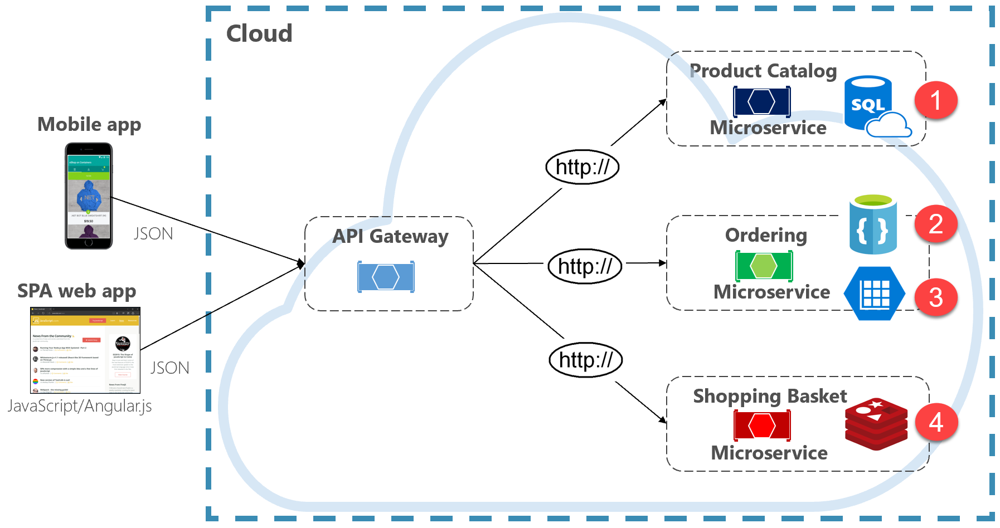
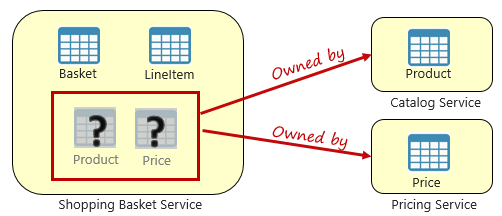
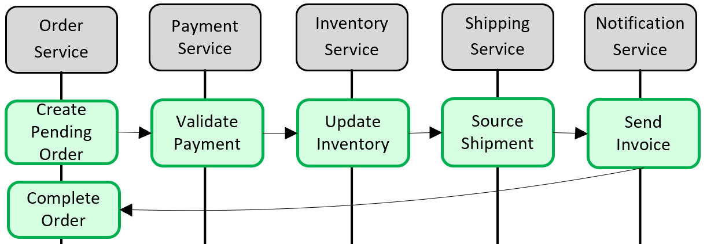
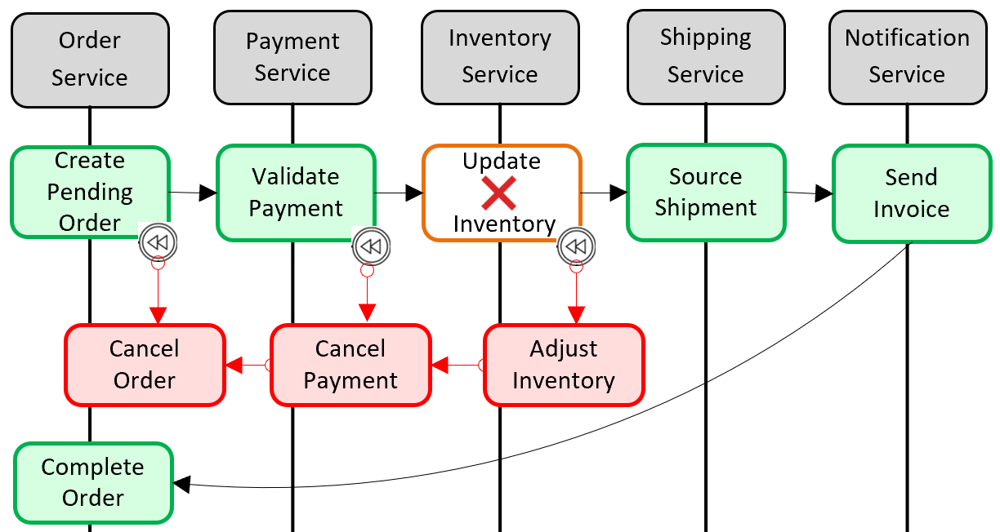
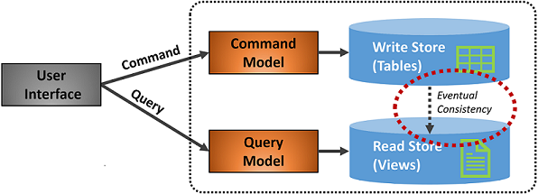

# Data Fundamentals

As we've seen throughout this book, a cloud-native approach changes the way you design, deploy, and manage applications. It also changes the way you manage and store data.

Figure 5-1 contrasts the differences.

**Figure 5-1**. Data management in cloud-native applications

Experienced developers will easily recognize the architecture on the left-side of figure 5-1. In this *monolithic application*, business service components collocate together in a shared services tier, sharing data from a single relational database.

In many ways, a single database keeps data management simple. Querying data across multiple tables is straightforward. Changes to data update together or they all rollback. [ACID transactions](/windows/desktop/cossdk/acid-properties) guarantee strong and immediate consistency.

Designing for cloud-native, we take a different approach. On the right-side of Figure 5-1, note how business functionality segregates into small, independent microservices. Each microservice encapsulates a specific business capability and its own data. The monolithic database decomposes into a distributed data model with many smaller databases, each aligning with a microservice. When the smoke clears, we emerge with a design that exposes a *database per microservice*.

## Database-per-microservice, why?

This database per microservice provides many benefits, especially for systems that must evolve rapidly and support massive scale. With this model...

- Domain data is encapsulated within the service
- Data schema can evolve without directly impacting other services
- Each data store can independently scale
- A data store failure in one service won't directly impact other services

Segregating data also enables each microservice to implement the data store type that is best optimized for its workload, storage needs, and read/write patterns. Choices include relational, document, key-value, and even graph-based data stores.

Figure 5-2 presents the principle of polyglot persistence in a cloud-native system.

**Figure 5-2**. Polyglot data persistence

Note in the previous figure how each microservice supports a different type of data store.

- The product catalog microservice consumes a relational database to accommodate the rich relational structure of its underlying data.
- The shopping cart microservice consumes a distributed cache that supports its simple, key-value data store.
- The ordering microservice consumes both a NoSql document database for write operations along with a highly denormalized key/value store to accommodate high-volumes of read operations.
  
While relational databases remain relevant for microservices with complex data, NoSQL databases have gained considerable popularity. They provide massive scale and high availability. Their schemaless nature allows developers to move away from an architecture of typed data classes and ORMs that make change expensive and time-consuming. We cover NoSQL databases later in this chapter.

 While encapsulating  data into separate microservices can increase agility, performance, and scalability, it also presents many challenges. In the next section, we discuss these challenges along with patterns and practices to help overcome them.  

## Cross-service queries

While microservices are independent and focus on specific functional capabilities, like inventory, shipping, or ordering, they frequently require integration with other microservices. Often the integration involves one microservice *querying* another for data. Figure 5-3 shows the scenario.

**Figure 5-3**. Querying across microservices

In the preceding figure, we see a shopping basket microservice that adds an item to a user's shopping basket. While the data store for this microservice contains basket and line item data, it doesn't maintain product or pricing data. Instead, those data items are owned by the catalog and pricing microservices. This aspect presents a problem. How can the shopping basket microservice add a product to the user's shopping basket when it doesn't have product nor pricing data in its database?

One option discussed in Chapter 4 is a [direct HTTP call](service-to-service-communication.md#queries) from the shopping basket to the catalog and pricing microservices. However, in chapter 4, we said synchronous HTTP calls *couple* microservices together, reducing their autonomy and diminishing their architectural benefits.

We could also implement a request-reply pattern with separate inbound and outbound queues for each service. However, this pattern is complicated and requires plumbing to correlate request and response messages.
While it does decouple the backend microservice calls, the calling service must still synchronously wait for the call to complete. Network congestion, transient faults, or an overloaded microservice and can result in long-running and even failed operations.

Instead, a widely accepted pattern for removing cross-service dependencies is the [Materialized View Pattern](/azure/architecture/patterns/materialized-view), shown in Figure 5-4.

**Figure 5-4**. Materialized View Pattern

With this pattern, you place a local data table (known as a *read model*) in the shopping basket service. This table contains a denormalized copy of the data needed from the product and pricing microservices. Copying the data directly into the shopping basket microservice eliminates the need for expensive cross-service calls. With the data local to the service, you improve the service's response time and reliability. Additionally, having its own copy of the data makes the shopping basket service more resilient. If the catalog service should become unavailable, it wouldn't directly impact the shopping basket service. The shopping basket can continue operating with the data from its own store.

The catch with this approach is that you now have duplicate data in your system. However, *strategically* duplicating data in cloud-native systems is an established practice and not considered an anti-pattern, or bad practice. Keep in mind that *one and only one service* can own a data set and have authority over it. You'll need to synchronize the read models when the system of record is updated. Synchronization is typically implemented via asynchronous messaging with a [publish/subscribe pattern](service-to-service-communication.md#events), as shown in Figure 5.4.

## Distributed transactions

While querying data across microservices is difficult, implementing a transaction across several microservices is even more complex. The inherent challenge of maintaining data consistency across independent data sources in different microservices can't be understated. The lack of distributed transactions in cloud-native applications means that you must manage distributed transactions programmatically. You move from a world of *immediate consistency* to that of *eventual consistency*.

Figure 5-5 shows the problem.

**Figure 5-5**. Implementing a transaction across microservices

In the preceding figure, five independent microservices participate in a distributed transaction that creates an order. Each microservice maintains its own data store and implements a local transaction for its store. To create the order, the local transaction for *each* individual microservice must succeed, or *all* must abort and roll back the operation. While built-in transactional support is available inside each of the microservices, there's no support for a distributed transaction that would span across all five services to keep data consistent.

Instead, you must construct this distributed transaction *programmatically*.

A popular pattern for adding distributed transactional support is the Saga pattern. It's implemented by grouping local transactions together programmatically and sequentially invoking each one. If any of the local transactions fail, the Saga aborts the operation and invokes a set of [compensating transactions](/azure/architecture/patterns/compensating-transaction). The compensating transactions undo the changes made by the preceding local transactions and restore data consistency. Figure 5-6 shows a failed transaction with the Saga pattern.

**Figure 5-6**. Rolling back a transaction

In the previous figure, the *Update Inventory* operation has failed in the Inventory microservice. The Saga invokes a set of compensating transactions (in red) to adjust the inventory counts, cancel the payment and the order, and return the data for each microservice back to a consistent state.

Saga patterns are typically choreographed as a series of related events, or orchestrated as a set of related commands. In Chapter 4, we discussed the service aggregator pattern that would be the foundation for an orchestrated saga implementation. We also discussed eventing along with Azure Service Bus and Azure Event Grid topics that would be a foundation for a choreographed saga implementation.

## High volume data

Large cloud-native applications often support high-volume data requirements. In these scenarios, traditional data storage techniques can cause bottlenecks. For complex systems that deploy on a large scale, both Command and Query Responsibility Segregation (CQRS) and Event Sourcing may improve application performance.  

### CQRS

[CQRS](/azure/architecture/patterns/cqrs), is an architectural pattern that can help maximize performance, scalability, and security. The pattern separates operations that read data from those operations that write data.

For normal scenarios, the same entity model and data repository object are used for *both* read and write operations.

However, a high volume data scenario can benefit from separate models and data tables for reads and writes. To improve performance, the read operation could query against a highly denormalized representation of the data to avoid expensive repetitive table joins and table locks. The *write* operation, known as a *command*, would update against a fully normalized representation of the data that would guarantee consistency. You then need to implement a mechanism to keep both representations in sync. Typically, whenever the write table is modified, it publishes an event that replicates the modification to the read table.

Figure 5-7 shows an implementation of the CQRS pattern.

**Figure 5-7**. CQRS implementation

In the previous figure, separate command and query models are implemented. Each data write operation is saved to the write store and then propagated to the read store. Pay close attention to how the data propagation process operates on the principle of [eventual consistency](https://www.cloudcomputingpatterns.org/eventual_consistency/). The read model eventually synchronizes with the write model, but there may be some lag in the process. We discuss eventual consistency in the next section.

This separation enables reads and writes to scale independently. Read operations use a schema optimized for queries, while the writes use a schema optimized for updates. Read queries go against denormalized data, while complex business logic can be applied to the write model. As well, you might impose tighter security on write operations than those exposing reads.

Implementing CQRS can improve application performance for cloud-native services. However, it does result in a more complex design. Apply this principle carefully and strategically to those sections of your cloud-native application that will benefit from it. For more on CQRS, see the Microsoft book [.NET Microservices: Architecture for Containerized .NET Applications](../microservices/microservice-ddd-cqrs-patterns/apply-simplified-microservice-cqrs-ddd-patterns.md).

### Event sourcing

Another approach to optimizing high volume data scenarios involves [Event Sourcing](/azure/architecture/patterns/event-sourcing).

A system typically stores the current state of a data entity. If a user changes their phone number, for example, the customer record is updated with the new number. We always know the current state of a data entity, but each update overwrites the previous state.

In most cases, this model works fine. In high volume systems, however, overhead from transactional locking and frequent update operations can impact database performance, responsiveness, and limit scalability.

Event Sourcing takes a different approach to capturing data. Each operation that affects data is persisted to an event store. Instead of updating the state of a data record, we append each change to a sequential list of past events - similar to an accountant's ledger. The Event Store becomes the system of record for the data. It's used to propagate various materialized views within the bounded context of a microservice. Figure 5.8 shows the pattern.

**Figure 5-8**. Event Sourcing

In the previous figure, note how each entry (in blue) for a user's shopping cart is appended to an underlying event store. In the adjoining materialized view, the system projects the current state by replaying all the events associated with each shopping cart. This view, or read model, is then exposed back to the UI. Events can also be integrated with external systems and applications or queried to determine the current state of an entity. With this approach, you maintain history. You know not only the current state of an entity, but also how you reached this state.

Mechanically speaking, event sourcing simplifies the write model. There are no updates or deletes. Appending each data entry as an immutable event minimizes contention, locking, and concurrency conflicts associated with relational databases. Building read models with the materialized view pattern enables you to decouple the view from the write model and choose the best data store to optimize the needs of your application UI.

For this pattern, consider a data store that directly supports event sourcing. Azure Cosmos DB, MongoDB, Cassandra, CouchDB, and RavenDB are good candidates.

As with all patterns and technologies, implement strategically and when needed. While event sourcing can provide increased performance and scalability, it comes at the expense of complexity and a learning curve.

