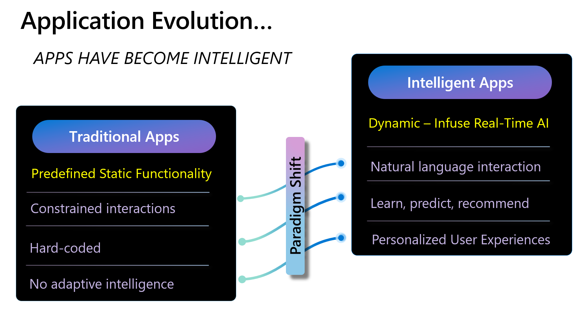

<!-- ---
title: The Application Evolution
description: The Path Forward
author: robvet
ms.date: 10/10/2024
--- -->

Blah, blah, blah

Figure 1.1 visually depicts the evolution from traditional static apps to dynamic intelligent apps.

**Figure 1-1**. The Intelligent Apps Evolution

Blah, blah, blah

- blah
- blah
- blah
- blah
- blah

Blah, blah, blah

### Blah, blah blah

So, what exactly is Cloud Native? Sit back, relax, and let us help you explore this new world.

